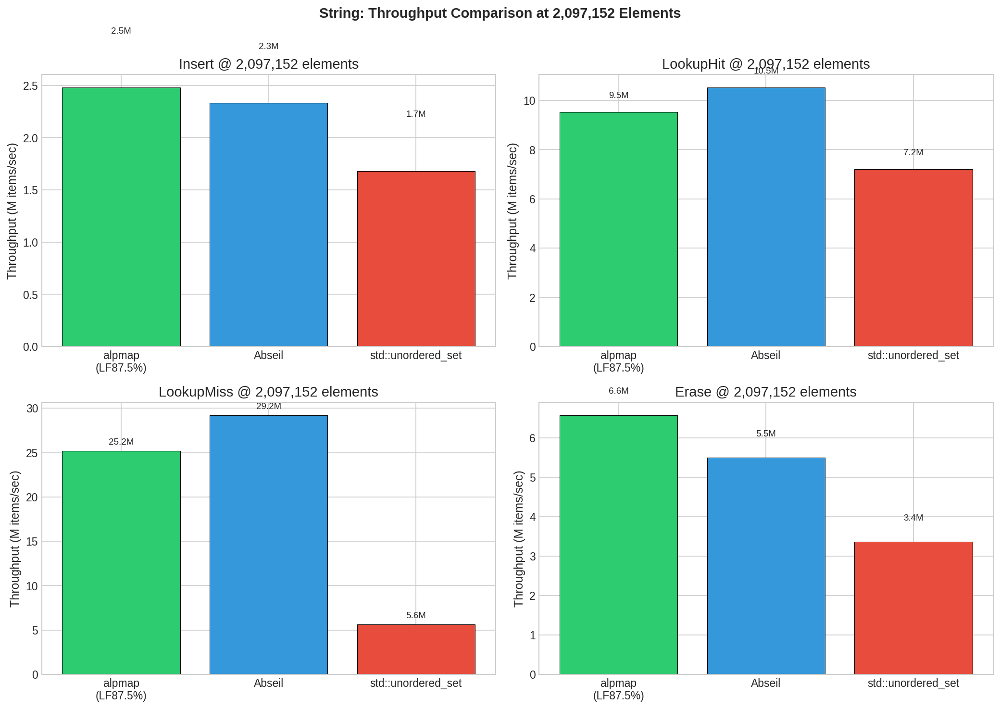
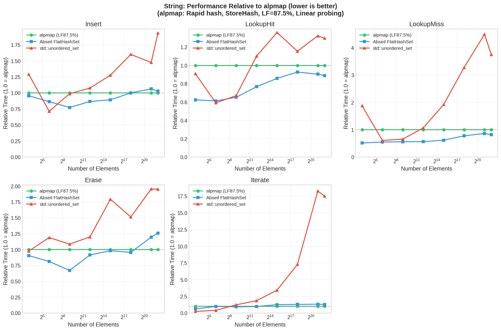

# alpmap

**High-performance SwissTable implementation with SIMD acceleration in C++23**

alpmap is a modern hash table library delivering 2-3x performance improvements over `std::unordered_map` through
SIMD-accelerated metadata scanning and an improved memory layout.

Pointers are unstable, as one would expect. It outperforms `abseil` in insertions, erasures, and iteration at large
sizes, while losing out on lookups and at small sizes.

## Key Features

### SIMD Acceleration

alpmap currently supports three backends.

- **SSE Backend**: 128-bit SSE intrinsics for baseline x86/x64 compatibility
- **EVE Backend**: Adaptive SIMD using the EVE library with automatic AVX/AVX2/AVX-512 support
- **std_simd Backend**: experimental SIMD implementation from the parallelism TS.

### Configuration

alpmap supports a variety of dimensions to configure the hash map.
By default, alpmap attempts to use `rapidhash`. You may need to provide a specialization for your type (
see [src/hashing/rapid.cppm](src/hashing/rapid.cppm)).

You can also manually choose between:

- `StoreHashTag` vs `NoStoreHashTag`: caching hashes or recomputing hashes on demand (for memory savings and to improve
  cache locality/iteration speed).
- `Linear` or `Quadratic` probing (by default quadratic).
- Hash mixing: by default disabled for `rapidhash`, but enabled for `std::hash`.

We also support custom allocators.

### Design

For more details into alpmap's memory layout and mechanisms, see the Doxygen site
at https://benaepli.github.io/alpmap/design.html.

## Performance Benchmarks

Here, we provide benchmarks of `alp::Set`. Since `alp::Set` and `alp::Map` both use the same underlying hash table,
both scale equivalently.

For complete benchmark details and additional graphs, see [benchmarks/results/](benchmarks/results/).

### Throughput Comparison (2M Elements, 32-byte String Keys)

This is where alpmap shines.



At 2 million elements with 32-byte string keys:

- **Insert**: ~2.5M items/sec
- **LookupHit**: ~9.5M lookups/sec
- **LookupMiss**: ~25.2M lookups/sec
- **Erase**: ~6.6M items/sec

### Scaling Behavior vs Baseline



Relative performance across container sizes (32 to 1M+ elements), normalized to alpmap as baseline (1.0). alpmap
demonstrates consistent scaling behavior, especially compared to `std::unordered_set`.

At large sizes, our iteration speed is approximately 1.5x that of `flat_hash_set` and 16x that of `std::unordered_set`.

## Quick Start

```cpp
import alp;
#include <iostream>
#include <string>

int main() {
    // Create a set
    alp::Set<std::string> names;
    names.emplace("Alice");
    names.emplace("Bob");

    if (names.contains("Alice")) {
        std::cout << "Found Alice\n";
    }

    // Create a map
    alp::Map<std::string, int> ages;
    ages.emplace("Alice", 30);
    ages.emplace("Bob", 25);

    if (auto it = ages.find("Alice"); it != ages.end()) {
        std::cout << "Alice is " << it->second << "\n";
    }

    // Iterate over elements
    for (const auto& [name, age] : ages) {
        std::cout << name << " is " << age << " years old\n";
    }

    return 0;
}
```

## Building from Source

### Requirements

- **C++23 compiler**: Clang 16+, GCC 14+, or MSVC 19.34+
- **CMake**: 3.28+ (3.30+ recommended for best module support)
- **Ninja**

### Quick Build

```bash
cmake --build build
```

For detailed building instructions, compiler configuration, and troubleshooting,
see [docs/building.md](docs/building.md).

## Advanced Features

### Choosing SIMD Backend

```cpp
import alp;

alp::Set<int, alp::RapidHasher, std::equal_to<>,
         alp::IdentityHashPolicy, alp::SseBackend> sseSet;
```

### Storage Policy Control

```cpp
// Force hash storage for POD types (trades memory for speed)
alp::Set<int, alp::RapidHasher, std::equal_to<>,
         alp::IdentityHashPolicy, alp::DefaultBackend,
         std::allocator<std::byte>, std::ratio<7, 8>,
         alp::StoreHashTag> cachedSet;
```

### Probing Scheme Selection

```cpp
// Use linear probing instead of quadratic (default)
alp::Set<int, alp::RapidHasher, std::equal_to<>,
         alp::IdentityHashPolicy, alp::DefaultBackend,
         std::allocator<std::byte>, std::ratio<7, 8>,
         alp::NoStoreHashTag, alp::LinearProbing> linearSet;
```

## Documentation

- **API Documentation**: https://benaepli.github.io/alpmap/
- **Design Overview**: https://benaepli.github.io/alpmap/design.html
- **Building Guide**: [docs/building.md](docs/building.md)

## Dependencies

We use FetchContent to fetch dependencies:

- Google Benchmark
- GTest
- EVE (optional)
- rapidhash (bundled)
- abseil (for benchmarking)

## License

MIT License - Copyright (c) 2025 Ben Aepli

See [LICENSE](LICENSE) for full details.

---

**Note**: alpmap requires C++23 modules support. Ensure your compiler and build system are properly configured.
See [docs/building.md](docs/building.md) for detailed setup instructions.
